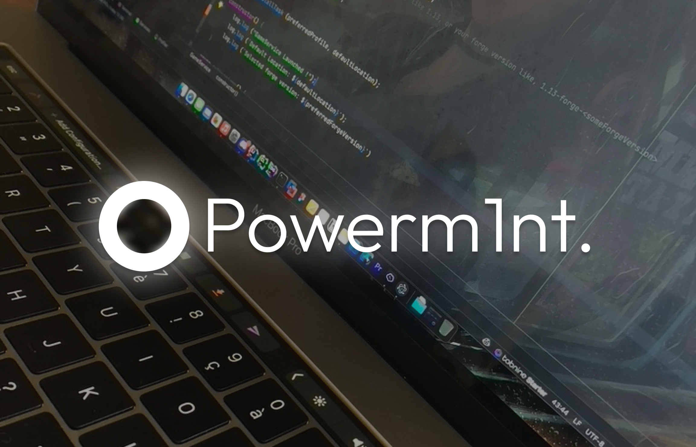

## Bio
Freelancer and Fullstack developer     
5 years of experience in web development.    
Studying computer science and software development. 

## Skills
Programming languages: JavaScript, Rust, Java, Swift  
Frameworks and tools: Node.js, Express.js, React, Redux, Vert.x, MongoDB, MySQL, Git  
Other skills : Azure/AWS, CI/CD, Linux, HTML, CSS, Sass.
## Recent projects
Project 1 : Project name - Project description  
Project 2 : Project name - Project description  
Project 3 : Project name - Project description  
## Contributions
Project Name - Contribution Description  
Project Name - Contribution Description  
Project Name - Contribution Description  
## Social networks
Discord: Powerm1nt#0001  
Instagram: @powerm1nt  
Twitter: @powerm1nt  
GitHub: @powerm1nt  
Mail: nukaworks@nuka.works
